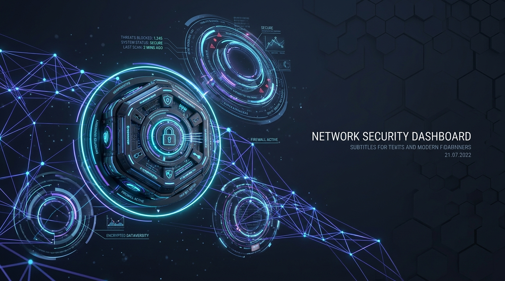
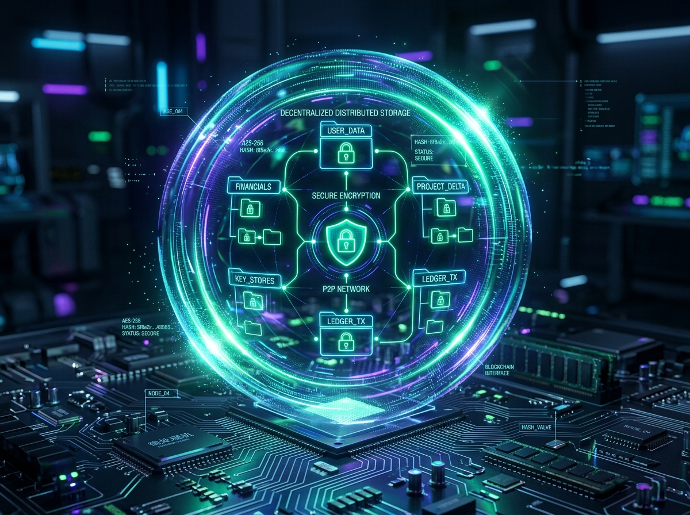
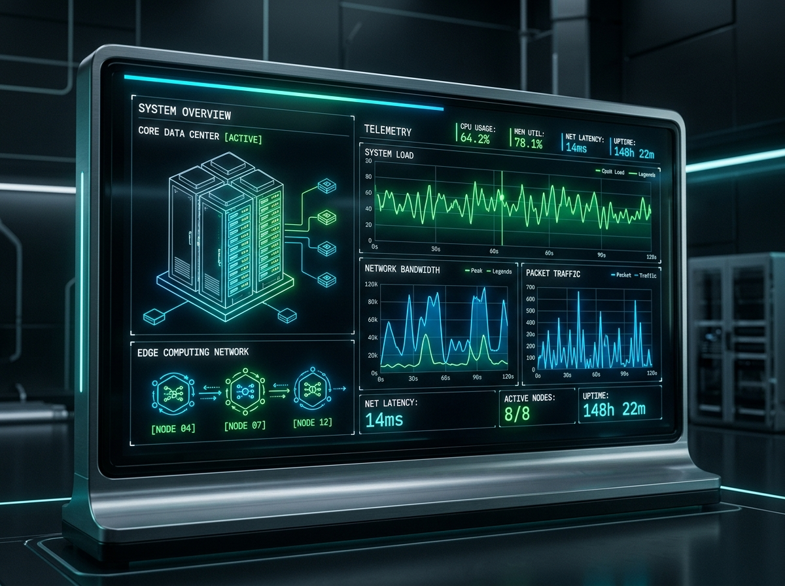

# 🛡️ NoorGuard Sovereign Controller (নূরগার্ড সোভারেন কন্ট্রোলার)

> **Decentralized Zero-Trust Mesh Network & Cryptographic Asset Management Console**
> *একটি সম্পূর্ণ বিকেন্দ্রীভূত, জিরো-ট্রাস্ট মেশ নেটওয়ার্ক এবং ক্রিপ্টোগ্রাফিক সম্পদ ব্যবস্থাপনা কন্ট্রোল প্যানেল।*

---



## 📌 সূচিপত্র (Table of Contents)
1. [Overview (পরিচিতি)](#-overview-পরিচিতি)
2. [Core Features (মূল বৈশিষ্ট্যসমূহ)](#-core-features-মূল-বৈশিষ্ট্যসমূহ)
3. [Visual Journey (ছবি ও ডায়াগ্রাম)](#-visual-journey-ছবি-ও-ডায়াগ্রাম)
4. [Tech Stack (ব্যবহৃত প্রযুক্তি)](#-tech-stack-ব্যবহৃত-প্রযুক্তি)
5. [Installation & Dev Guide (ইনস্টলেশন ও ডেভেলপমেন্ট গাইড)](#-installation--dev-guide-ইনস্টলেশন-ও-ডেভেলপমেন্ট-গাইড)
6. [Security & Compliance (নিরাপত্তা ও কমপ্লায়েন্স)](#-security--compliance-নিরাপত্তা-ও-কমপ্লায়েন্স)

---

## 🌐 Overview (পরিচিতি)

**NoorGuard Sovereign Controller** is an advanced full-stack decentralized terminal designed for secure edge device orchestration, peer-to-peer mesh networking, cryptographic file distribution, and live telemetry monitoring. Utilizing a zero-trust model, all logs are sealed with secure hashes, actions require biometric simulation checks, and files can be securely beamed across peer nodes or synced with cloud providers.

**নূরগার্ড সোভারেন কন্ট্রোলার** হলো একটি অত্যাধুনিক ফুল-স্ট্যাক বিকেন্দ্রীভূত টার্মিনাল। এটি সুরক্ষিত এজ ডিভাইস অর্কেস্ট্রেশন, পিয়ার-টু-পিয়ার মেশ নেটওয়ার্কিং, ক্রিপ্টোগ্রাফিক ফাইল ডিস্ট্রিবিউশন এবং লাইভ টেলিমেট্রি মনিটরিংয়ের জন্য ডিজাইন করা হয়েছে। জিরো-ট্রাস্ট সিকিউরিটি মডেলের মাধ্যমে প্রতিটি অ্যাকশন সুরক্ষিত হ্যাশ দ্বারা সিল করা হয়, বায়োমেট্রিক সিমুলেশন ভেরিফাই করা হয় এবং ডাটা সরাসরি লোকাল নোড সমূহে বিম করা যায়।

---

## ⚡ Core Features (মূল বৈশিষ্ট্যসমূহ)

### 📊 1. Overview Dashboard (মূল ড্যাশবোর্ড)
- **Biometric Shield (বায়োমেট্রিক শিল্ড)**: Multi-modal biometric access simulation that guards critical actions (Mesh synchronization, log purging, firmware flashes).
- **Audit Console (অডিট টার্মিনাল)**: Live system telemetry and cryptographic ledger validation tracking all operations in real-time.
- **Surroundings Monitor (পরিবেশগত সেন্সর)**: Track real-time ambient noise, seismic tremors, light intensity, and physical vault integrity.

### 💻 2. Devices Matrix (ডিভাইস ম্যাট্রিক্স)
- Granular tracking of all edge devices (Sovereign Gateways, Mobile vaults, Admin Workstations).
- Instant firmware status checking and biometric-verified updates.
- Real-time latency, bandwidth, and status monitoring.

### 🕸️ 3. P2P Mesh Network (পিয়ার-টু-পিয়ার নেটওয়ার্ক ম্যাপ)
- Real-time **D3.js interactive topology simulation** mapping wireless linkages.
- Visualize node roles, dynamic ping, and secure communication channels.
- Mesh syncing engine verifying topological integrity.

### ⛓️ 4. Cryptographic Ledger (ক্রিপ্টোগ্রাফিক লেজার)
- Block-by-block immutable record of all system events.
- Each block is chained with SHA-256 hashes containing previous-block validation seals.
- Verification matrix with a visual block explorer.

### 📈 5. Edge Telemetry Monitor (এজ টেলিমেট্রি মনিটর)
- Decoupled real-time monitoring of CPU, Memory, Temperature, and Network I/O for each device.
- Fully custom rule-based dynamic alarm triggers (Anomaly alerts).
- Adjustable thresholds with automatic log alerting for out-of-bounds parameters.

### 📁 6. Sovereign File Manager & Sharing Hub (ফাইল ম্যানেজার ও শেয়ারিং হাব)
- **Drag & Drop and Manual Uploads**: Secure browser and dragging support for instant file encryption inside browser cache storage.
- **Dynamic File Creator**: Write and encrypt text documents directly in the sovereign container.
- **P2P Encrypted Beam (ডিভাইস বিমিং)**: Directly beam encrypted files to any device in the mesh.
- **Google Drive Syncing & Sealing**: Push cryptographically signed and sealed archives directly to your Google Drive via OAuth2.

---

## 🎨 Visual Journey (ছবি ও ডায়াগ্রাম)

### 🛡️ 1. Project Hero Interface (প্রজেক্ট ব্যানার)
The primary layout features an ultra-polished deep slate neon command terminal with high-contrast indicator lights and real-time biometric access verification modules.


### 📁 2. Secure File Manager & Cryptographic Vault (ফাইল ম্যানেজার ও ভল্ট)
Our customized storage system encrypts every upload using **AES-GCM 256** and generates irreversible SHA-256 cryptographic hashes to prevent tampering.



### 📈 3. Decentralized Edge Telemetry (এজ টেলিমেট্রি মনিটরিং)
The real-time telemetry engine tracking metrics on decentralized nodes, displaying alerts when variables exceed predefined safety boundaries.



---

## 🛠️ Tech Stack (ব্যবহৃত প্রযুক্তি)

- **Frontend**: React 18+ (Vite), TypeScript, Tailwind CSS, Motion (Framer Motion).
- **Visuals**: Lucide Icons, Custom 3D Cybernetic assets.
- **Charts & Topology**: Recharts (for telemetry analytics), D3.js (for dynamic Mesh P2P network rendering).
- **Authentication & Cloud Storage**: Firebase (Firestore/Auth) & Google Drive API (OAuth2 Integration).
- **Backend**: Node.js Express server acting as a secure OAuth proxy for API calls.

---

## ⚙️ Installation & Dev Guide (ইনস্টলেশন ও ডেভেলপমেন্ট গাইড)

### Requirements (প্রয়োজনীয়তা)
- **Node.js** (v18 or higher)
- **NPM** (v9 or higher)

### Setup Instructions (সেটআপ নির্দেশিকা)

1. **Install dependencies (নির্ভরতা ইনস্টল করুন)**:
   ```bash
   npm install
   ```

2. **Configure environment variables (এনভায়রনমেন্ট ভেরিয়েবল সেট করুন)**:
   Create a `.env` file in the root based on `.env.example`:
   ```env
   GEMINI_API_KEY=your_gemini_key_here
   ```

3. **Run in development mode (ডেভেলপমেন্ট সার্ভার চালু করুন)**:
   ```bash
   npm run dev
   ```
   The dev server will be live on [http://localhost:3000](http://localhost:3000).

4. **Build for production (প্রোডাকশন বিল্ড)**:
   ```bash
   npm run build
   ```

---

## 🔒 Security & Compliance (নিরাপত্তা ও কমপ্লায়েন্স)

1. **Zero-Trust (জিরো-ট্রাস্ট)**: No action can be taken without validation from the client state.
2. **Local First (লোকাল ফার্স্ট)**: Files and telemetry are handled in localized sandboxed browser arrays, protecting your data from server-side leaks.
3. **Biometric Guard (বায়োমেট্রিক প্রোটেকশন)**: Secure interactive triggers preventing accidental or malicious configuration changes.

---
*Created with 🤍 by NoorGuard Sovereign Core Engineering Team. Protect your assets, secure your node.*
